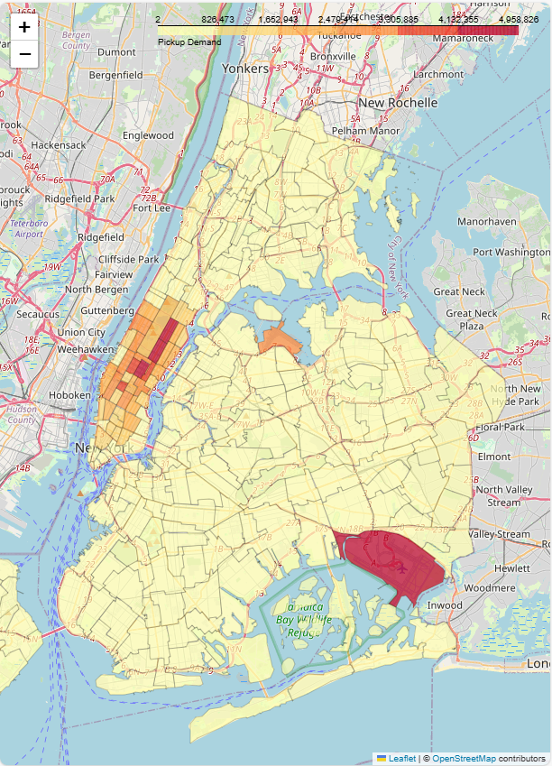

# 🚕 NYC TLC Taxi Demand Forecasting

**Forecasting NYC taxi demand using time‑series modeling, statistical analysis, and machine learning.** This project turns raw TLC trip data into actionable insights—surfaced through clean visualizations, seasonality modeling, and forward‑looking demand predictions. It applies data engineering, forecasting, and analytical skills.

---

## 📊 Project Preview



*Visuals illustrate spacial pick-up demand.*

---

## 📁 Data Source

NYC Taxi & Limousine Commission (TLC) Trip Records:

* Yellow Cab Data Dictionary: [https://www.nyc.gov/assets/tlc/downloads/pdf/data_dictionary_trip_records_yellow.pdf](https://www.nyc.gov/assets/tlc/downloads/pdf/data_dictionary_trip_records_yellow.pdf)
* Green Cab Data Dictionary: [https://www.nyc.gov/assets/tlc/downloads/pdf/data_dictionary_trip_records_green.pdf](https://www.nyc.gov/assets/tlc/downloads/pdf/data_dictionary_trip_records_green.pdf)

Dataset fields include timestamps, geolocation IDs, distances, fares, payment types, and passenger counts. Data quality depends on vendor reporting.

---

## 🔄 Workflow Overview

### **1. Data Preparation**

* Load hourly TLC trip data.
* Aggregate into daily total rides.
* Fill missing dates using linear interpolation.

### **2. Exploratory Analysis**

* Plot ACF/PACF.
* Identify weekly (7‑day) seasonality.

### **3. Modeling**

* ARIMA for non‑seasonal structure.
* SARIMA for trend + weekly seasonality.
* Prophet for trend + seasonality + holidays.

### **4. Evaluation**

Metrics used:

* MAE
* RMSE
* MAPE

Example:

```
MAE:  11125.95
RMSE: 13720.65
MAPE: 7.78%
```

MAPE below 10% indicates solid forecast accuracy.

---

## 🔍 Key Insights

* ACF/PACF patterns support ARIMA(1,1,1) or ARIMA(1,1,2).
* Seasonal performance improves with SARIMA(1,1,1)(1,0,1,7).
* Prophet handles seasonality and long‑term trends with minimal tuning.

---


---

## ⭐ Summary

* Combines **data engineering + time series modeling + ML forecasting**.
* Demonstrates **real‑world pipeline design** with partitioned data.
* Easily extendable to geographical clustering, LSTM models, or deployment.
